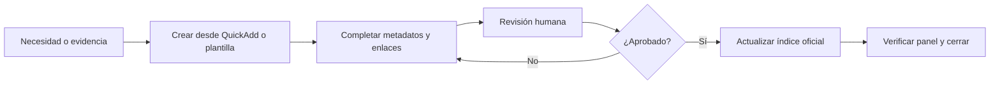
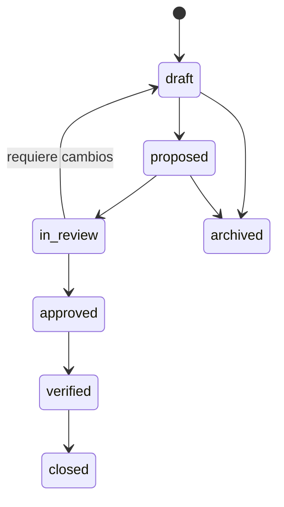

# Flujo de notas

## Secuencia común

## Tipo, plantilla y destino

| Necesidad | Plantilla | Convención | Destino canónico |
|---|---|---|---|
| Estado diario | `Template_Daily_Status` | `YYYY-MM-DD.md` | `00_PROJECT_CONTROL/DAILY_STATUS/` |
| Evento | `Template_Calendar_Event` | `YYYY-MM-DD_Titulo.md` | `00_PROJECT_CONTROL/CALENDAR_EVENTS/` |
| Requisito | `Template_Requirement` | `REQ-000_Titulo.md` | `01_Requirements/Requirements/` |
| Interfaz | `Template_Interface` | `ICD-000_Titulo.md` | `02_Systems_Engineering/Interfaces/` |
| Decisión | `Template_Decision` | `DEC-000_Titulo.md` | `02_Systems_Engineering/Decisions/` |
| Riesgo | `Template_Risk` | `RSK-000_Titulo.md` | `02_Systems_Engineering/Risks/` |
| Prueba | `Template_Test` | `TST-000_Titulo.md` | `07_TESTING_VALIDATION/Tests/` |
| Reporte de falla | `Template_Failure_Report` | `FR-000_Titulo.md` | `07_TESTING_VALIDATION/Failures/` |
| Minuta | `Template_Meeting` | `YYYY-MM-DD_Tema.md` | Carpeta adecuada en `11_MEETINGS/` |
| Bucle abierto | Captura QuickAdd | Una viñeta con `#bucle-abierto` | `02_Systems_Engineering/Open_Technical_Questions.md` |

## Ciclo de estados

No todos los tipos usan todos los estados. Consulte la plantilla y el `README.md` del área.

## Quién cambia el estado

- La persona autora puede mantener `draft` y preparar `proposed`.
- El responsable técnico mueve una nota a `in_review`.
- Solo la autoridad definida en roles o RACI puede usar `approved`.
- `verified` requiere evidencia enlazada.
- `closed` requiere criterio de cierre satisfecho.
- `archived` conserva historial; no equivale a borrar.

## Índices humanos y notas individuales

Los registros como `Decision_Log.md`, `Risk_Register.md` o `Test_Log_Index.md` son puntos de lectura humana. Los objetos individuales alimentan Dataview. Al crear o aprobar un objeto, mantenga ambos niveles coherentes.

## Ejemplos

Las notas con `status: example` enseñan el formato y están excluidas de consultas operativas. Nunca cambie una nota `*-000_Example.md` para convertirla en trabajo real.

